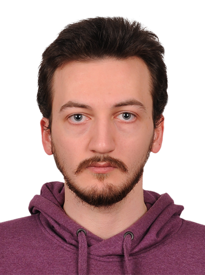

{fig-align="center" width="191"}

# Education

-   B.S., Mechanical Engineering, Yıldız Technical University, Turkey, 2018 - 2023.
-   M.S., Engineering Management, Hacettepe University, Turkey, 2025 - Ongoing

# Experience

## Employments

-   Turkish Aerospace, Fatigue & Damage Tolerance Engineer, June 2023 - Present

## Internships

-   Turkish Aerospace, Sky Experience Engineering Intern, December 2022 - June 2023

-   TEMSA, Marketing Intern, 2022

-   Tridi.co, Manufacturing Intern, 2022

-   Yağmaksan, Manufacturing Intern, 2021

# Publications

-   Gavcar, B., Sumer, E. H., Sagbas, B., & Katiyar, J. K. (2023). Effect of build orientation on the green tribological properties of multi-jet fusion manufactured PA12 parts. *Proceedings of the Institution of Mechanical Engineers, Part J: Journal of Engineering Tribology*, *237*(12), 2213-2223.

# Competencies

R, Quarto, Git, Python, Matlab, MSC Nastran/Patran, HyperMesh, Abaqus, nCode

# Hobbies

Basketball, Music, Movies
